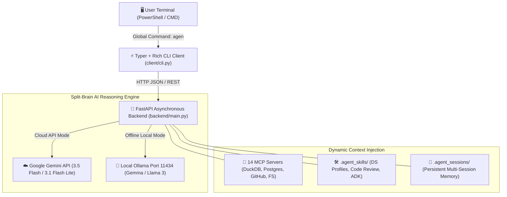

# ⚡ Terminal Agent (v0.2.0)
**High-Performance Split-Brain Agentic AI & Development Assistant for Windows x64**

[](https://github.com/)
[](https://github.com/)
[](https://github.com/)
[](https://opensource.org/licenses/MIT)

---

## 🌌 Overview
**Terminal Agent** is a lightning-fast, terminal-native AI coding assistant engineered specifically for **Windows 64-bit (x64)** workflows. Designed with a custom **Stealth Hardware Aesthetic** (`#00ffff` neon cyan, `#5d3fd3` deep purple, and true black), it solves traditional AI CLI bottlenecks by implementing an advanced **Split-Brain Architecture**:
1. **The Brain (Backend)**: An asynchronous **FastAPI + LangChain** service running locally in the background, managing token limits, conversation memory graphs, external connectors, and multi-model routing.
2. **The Muscle (Client)**: A lightweight, instant-start **Typer + Rich** terminal client accessible from anywhere via global `agen` or `agent` commands.

---

## 🔥 Key Features

### 1. 🧠 Seamless Hybrid LLM Engine (Cloud + Offline)
* **Cloud Mode (Default)**: Direct integration with Google's flagship models—`gemini-3.5-flash` for complex reasoning/refactoring and `gemini-3.1-flash-lite` for high-speed file lookups and summaries.
* **Offline Local Mode**: Native **Ollama / Gemma** routing over port `11434`. Switch instantly to local models (`gemma:7b`, `gemma4`, `llama3`, `deepseek-coder`) for **unlimited free offline tokens** and private dataset analysis!

### 2. 🔌 14 Model Context Protocol (MCP) Connectors
Connect external data silos, web scrapers, and database engines directly into your AI's reasoning loop with zero hardcoded API scripts:
* **Databases & Analytics**: `motherduck` (local DuckDB), `postgresql`, `sqlite`, `bigquery`
* **Files & Cloud Storage**: `filesystem`, `gdrive`
* **DevOps & Code**: `github`, `docker`
* **Web & AI Search**: `puppeteer`, `tavily`, `fetch`, `brave_search`
* **Cognitive Enhancements**: `sequential_thinking`, `memory`

### 3. 🛠️ 13 Pre-Built Domain-Specific Agent Skills
Modular markdown instructions that enforce rigorous engineering standards:
* **Data Science & Deep Learning**: EDA & Plotting, Data Interpretation (CI & p-value reporting), Feature Extraction, Statistical Analysis, Predictive Modeling, PyTorch DL Scripting.
* **Software Engineering**: Code Style (PEP 484, vectorization), Code Review Loop, Custom ADK, Python Tool Creation, Presentation & Storytelling.

### 4. ⚡ Terminal-Native Workflow & Slash Commands
* **`@filepath` Syntax**: Dynamically inject file contents directly into any prompt (e.g., `agen chat "Find security bugs in @backend/main.py"`).
* **Interactive REPL Commands**: Control everything without leaving your keyboard: `/session <id>`, `/clear`, `/local <model>`, `/gemini`, `/models`, and `/help`.

---

## 🚀 Quickstart & Installation (Windows x64)

We provide two official deployment methods for Windows 64-bit systems:

### Method 1: PowerShell One-Liner Web Installer (`irm | iex`)
Ideal for rapid developer setup and CI/CD pipelines. Open PowerShell and execute:
```powershell
irm https://raw.githubusercontent.com/<user>/agentic/main/deploy/install.ps1 | iex
```
*Creates an isolated environment in `%USERPROFILE%\.local\share\TerminalAgent`, installs all dependencies, and registers global `agen` / `agent` commands in your PATH.*

### Method 2: Standalone MSI / EXE Windows Installer
Ideal for enterprise workstations and offline distribution.
1. Download `TerminalAgent-Setup-x64.msi` or `agen.exe` from the **[GitHub Releases Tab](../../releases)**.
2. Run the installer to automatically configure Start Menu shortcuts and system PATH entries.
*(To compile from source, run `.\deploy\build_msi.ps1` in PowerShell).*

---

## 📖 Command Cheat Sheet

| Command | Description | Example |
| :--- | :--- | :--- |
| `agen init` | Initialize `.agent_skills/` or install skill profiles | `agen init --profile ds` or `agen init --all` |
| `agen chat` | Open REPL or send a prompt (supports `@file` syntax) | `agen chat "Explain CUDA cores" --tough` |
| `agen exec` | Generate and execute Python code locally in sandbox | `agen exec "Plot an IQR boxplot for df.csv"` |
| `agen review` | Read-only security and performance code review | `agen review client/cli.py --focus "Big-O complexity"` |
| `agen vision` | Multimodal analysis of images, charts, and diagrams | `agen vision architecture.png "Explain this flowchart"` |
| `agen mcp` | Manage MCP connectors (`list`, `enable`, `disable`, `status`) | `agen mcp enable motherduck` |
| `agen local` | Manage offline Ollama LLMs (`list`, `use`, `cloud`, `status`) | `agen local use gemma:7b` |
| `agen session` | Manage conversation memory graphs (`list`, `clear`) | `agen session clear default` |

---

## 🏗️ Architecture Diagram


---
**Built with precision for high-performance engineering.**
